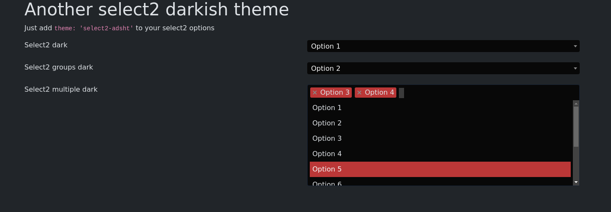

# Another select2 darkish theme



## DEMO

[https://fredtux.github.io/select2-adsht/](https://fredtux.github.io/select2-adsht/)

## Installation

### NPM
Install the package

```bash
npm install select2-adsht
```

### Laravel
Include the css file in your **app.scss** file

```scss
// select2-adsht theme
@import 'select2-adsht/dist/select2-adsht.min.css';
```


### Directly
Include the css file in your html file

```html
<link rel="stylesheet" type="text/css" href="dist/select2-adsht.min.css">
```

## Usage

Specify the theme in your select2 options

```js
$(document).ready(function() {
            $('.select2-dark').select2({
                theme: 'select2-adsht'
            });
});
```


